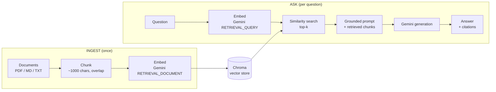

# RAG — Chat With Your Docs

Ask questions about your own documents and get answers **with citations** — and a
real **evaluation harness** that measures whether the answers are any good. Built
on Google Gemini (free tier) for both embeddings and generation.

**🔗 Live demo:** [rag-chat-with-docs on Streamlit Cloud](https://rag-chat-with-docs-glhwnaa6oappyprnytymfnb.streamlit.app) —
a Streamlit chat over the bundled sample docs. Bring your own free Gemini key
([get one here](https://aistudio.google.com/apikey)); the demo runs your
questions on your key so it never rate-limits.

```
  rag ingest examples/
  rag ask "Do you ship internationally?"
  -> No, Nimbus Coffee does not currently ship internationally [1].
       Sources: [1] examples/handbook.md (chunk 0)
```

## Why this exists

A language model can't answer questions about documents it never saw, and pasting
them into every prompt is slow, expensive, and blows past the context window.
**Retrieval-Augmented Generation** solves it: index the documents once, then at
question time retrieve only the few most relevant chunks and ground the model on
those. It's the most-deployed pattern in production AI.

This build focuses on the two things that separate a real RAG system from a demo:

1. **Citations + grounding.** Answers cite the source chunks, and the system says
   "I don't know" instead of inventing an answer when the documents don't cover
   the question.
2. **Evaluation.** A golden question set scored on **faithfulness**, **relevance**
   (LLM-as-judge), and **retrieval hit** (deterministic). You can't improve what
   you can't measure — and "I built evals" is the strongest production signal.

## How it works

<!-- Source: docs/architecture.mmd -->


| File | Role |
|------|------|
| [`ingest.py`](src/ragchat/ingest.py) | Load PDF/txt/md, chunk with overlap (pure, unit-tested) |
| [`embed.py`](src/ragchat/embed.py) | Gemini embeddings, with document/query task-type hints |
| [`store.py`](src/ragchat/store.py) | Chroma wrapper; stable ids so re-ingest updates, not duplicates |
| [`rag.py`](src/ragchat/rag.py) | `RagIndex`: `ingest()` / `query()`, grounding prompt, citation parsing |
| [`eval.py`](src/ragchat/eval.py) | Golden-set runner + LLM-as-judge scoring |
| [`_gemini.py`](src/ragchat/_gemini.py) | Generation call with 429 retry/backoff (free-tier resilience) |

## Run it

Requires a Gemini API key ([free key here](https://aistudio.google.com/apikey)):

```bash
export GEMINI_API_KEY=...          # or put it in a .env file

uv run rag ingest examples/         # index the sample docs
uv run rag ask "How many days to return an unopened bag?"
uv run python -m ragchat.eval       # score the system on the golden set

uv run streamlit run app.py         # the chat UI, locally
```

Use it as a library in ~5 lines:

```python
from ragchat import RagIndex

idx = RagIndex()
idx.ingest(["examples/"])
print(idx.query("What roast has blueberry notes?").format())
```

## Evaluation

`python -m ragchat.eval` runs a golden set and prints per-question and aggregate
scores:

```
faith  rel  hit  question
    5    5  yes  How many days do I have to return an unopene...
    5    5  yes  Do you ship internationally?
    ...
avg faithfulness 5.00/5   avg relevance 5.00/5   retrieval hit 100%
```

The eval already earned its keep during development: it caught the system falsely
answering "I don't know" to *"Do you ship internationally?"* even though the
handbook says it doesn't — a grounding-prompt bug (negative facts were being
treated as "no answer"). Fixing the system prompt took the score from 1/5 to 5/5.
That's the whole point of evals: they catch what spot-checking misses.

## Tests

Schema and chunking logic are tested without an API key:

```bash
uv run pytest
```

## Notes / future work

- Gemini free tier is rate-limited (a few generations/minute); `_gemini.py` backs
  off and retries on 429 so the eval completes instead of crashing.
- Future: reranking, hybrid (keyword + vector) search, OCR for scanned PDFs.

---

*Project 2 of an AI-engineering portfolio. Built with retrieval, citations, and evaluation — the skills that show up in real job descriptions.*
